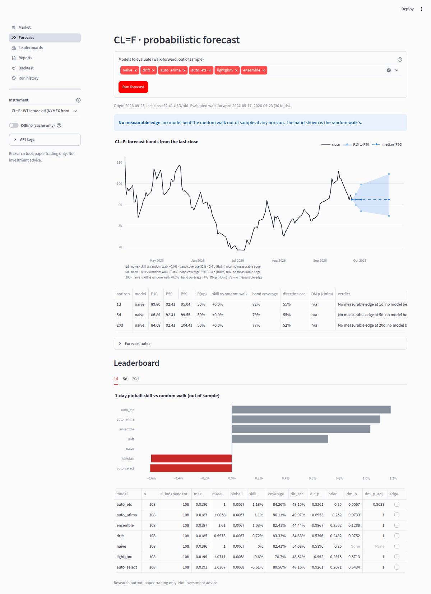
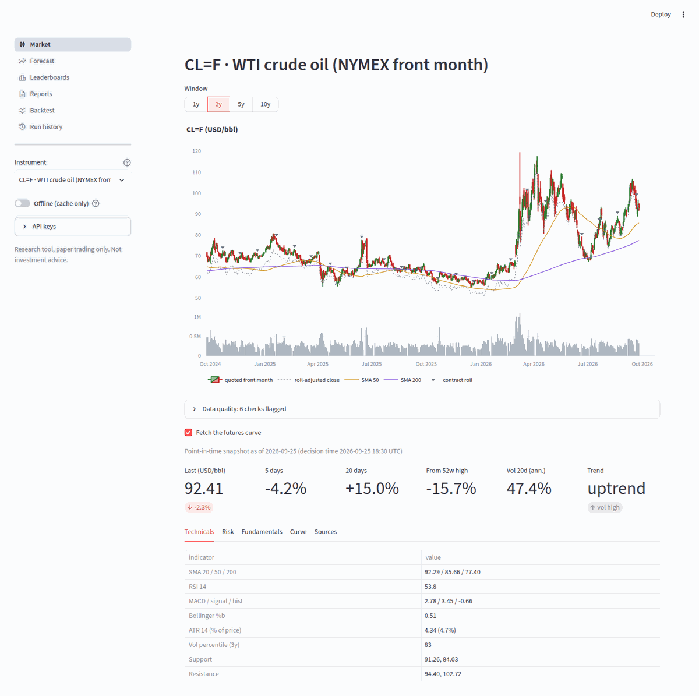
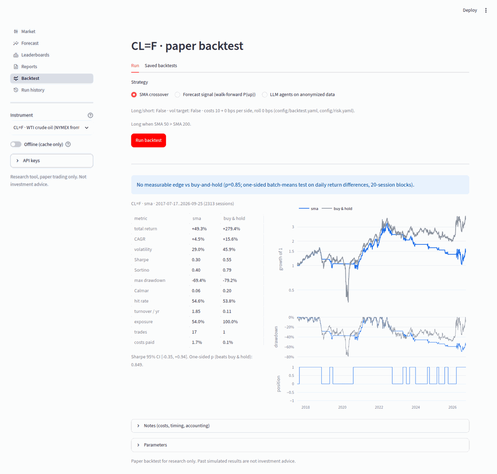

# commodity-fa

A local research tool for **energy-commodity analysis and probabilistic price forecasting**: WTI, Brent, Henry Hub, TTF, heating oil and RBOB, plus ETF proxies. Claude agents form views. Deterministic, tested Python does all the math.

> Research and learning only. Paper trading only: no broker connections and no order execution. **Not investment advice.**



## Status
All phases (0–7) are done: data layer, analytics, forecasting, agents, paper backtester, dashboard, and an automatically scored eval set. See `CLAUDE.md` for the architecture, conventions and leakage rules.

## Setup (about 10 minutes)
You need `git` and [uv](https://docs.astral.sh/uv/getting-started/installation/). uv installs Python 3.12 and every dependency for you.

| Step | Command / action | Time |
|---|---|---|
| 1. Install uv (if needed) | `curl -LsSf https://astral.sh/uv/install.sh \| sh` (Windows: see the uv docs) | 1 min |
| 2. Clone and install | `git clone <repo-url> commodity-fa && cd commodity-fa && uv sync` (about 1 GB installed) | 1–4 min |
| 3. Keys | `cp .env.example .env`, then paste your keys (table below). An **EIA key is free and takes a minute**; without it the shared `DEMO_KEY` is used, which runs out after a few dozen requests per hour | 2–4 min |
| 4. Check | `uv run fa doctor` (Python, config, keys, cache, and whether each data provider is reachable) | 10 s |
| 5. Open the dashboard | `uv run streamlit run app/main.py` → http://localhost:8501 | first page ~20 s |

Measured on a fresh clone with only `.env` filled: `uv sync` took 6 s on a datacenter link, `fa doctor` 3 s, and the first forecast for WTI (10 years of data fetched and every model evaluated walk-forward) 77 s. Later runs use the disk cache.

## Commands
```bash
uv run fa doctor                      # setup check
uv run fa analyze CL=F --no-llm       # numeric snapshot (technicals, risk, inventories, COT, curve)
uv run fa forecast CL=F               # 1/5/20-day P10/P50/P90 + P(up), with measured skill vs a random walk
uv run fa backtest CL=F -s sma        # paper backtest vs buy-and-hold, with costs (also: -s forecast, -s agent)
uv run fa ask "What was the 3-2-1 crack spread?" -s CL=F --as-of 2026-06-01   # one question, code-verified
uv run fa report CL=F                 # full agent report: reports/CL_F_<date>.md/.html/.json
uv run fa eval                        # score the research agent on evals/questions.jsonl
uv run streamlit run app/main.py      # dashboard (or: make app)

uv run fa data prices CL=F [--offline]  # raw data: prices + roll masks + quality report
uv run fa data eia CL=F | cot CL=F | fred DGS10 | news CL=F
make check                            # lint + typecheck + tests (offline fixtures)
uv run pytest -m network              # live checks against the providers
```
`fa ask`, `fa report`, `fa eval` and agent backtests need `ANTHROPIC_API_KEY`; everything else runs without it.

## API keys
| Key | Used for | Where to get it |
|---|---|---|
| `ANTHROPIC_API_KEY` | agents: `fa ask`, `fa report`, `fa eval`, agent backtests | console.anthropic.com |
| `EIA_API_KEY` | inventories, storage, production (free) | https://www.eia.gov/opendata/register.php |
| `FRED_API_KEY` | macro series (free, optional) | https://fred.stlouisfed.org/docs/api/api_key.html |

CFTC Commitments of Traders data and Yahoo prices need no key. Keys live only in `.env` (git-ignored). They are never printed, logged or written to reports; a test sets fake keys and scans every file the tool writes.

## Screenshots
| Market | Backtest |
|---|---|
|  |  |

## Forecasts and honesty
`fa forecast` evaluates every model walk-forward and only shows a model's forecast if it beats the naive random walk out of sample. The test is a batch-means Diebold-Mariano test with a Holm correction across all models and horizons. Otherwise the report shows the random-walk band and says **"No measurable edge"**. For energy futures that is the usual result. Optional foundation model: `uv sync --extra foundation` (Chronos-2, CPU).

## Agent reports (`fa report`)
The report pipeline runs five analysts in parallel: supply/demand, technical, news and sentiment, macro, and a forecast interpreter. A bull and a bear researcher then debate for 2 rounds, a risk reviewer suggests a maximum exposure, and a validator and a synthesizer finish the report. Models and effort per role are set in `config/models.yaml`.
- **Every number in the text is checked in code.** Each one must match a value in the tool result the sentence cites (`[T3]`). Unverifiable sentences go back to the agent to fix; any that still fail are removed and listed in the report.
- **The rating is computed in code** from the analysts' stances and the forecast's measured edge, using the weights in `config/agents.yaml`. The synthesizer explains the rating; it cannot change it.
- **Cost:** the default hard budget is $1.00 per run. The run aborts cleanly if it's exceeded. The cost is printed, and each run's full trail (every tool call, result and LLM call) is written to `.runs/<timestamp>_<id>.jsonl`.

## Paper backtests (`fa backtest`)
Paper only; nothing here can place an order. Targets are decided at the close and executed at the **next open**, with commission, slippage and roll costs (`config/risk.yaml`). Every strategy is reported next to **buy-and-hold over the same window**, with a Sharpe confidence interval.
- `-s sma`: 50/200-day moving-average crossover (long-only by default; `config/backtest.yaml`).
- `-s forecast`: goes long when the walk-forward P(up) at 5 days is at least 0.55. Thresholds are fixed in config, not tuned on the backtest.
- `-s agent`: the analysts decide every 20 sessions on **anonymized** data: prices rebased to 100, no names, dates, units, news or macro. This fights the LLM's memory of what happened next. It asks for `--yes` when the estimated cost exceeds `max_usd_backtest` ($5 by default), which is also a hard cap.

## Dashboard (`uv run streamlit run app/main.py`)
Opens at http://localhost:8501. Pick an instrument in the sidebar (type to search, or enter any Yahoo ticker such as `SPY`), or switch on **Offline** to use only cached data.
- **Market:** candlesticks of the quoted front month, the roll-adjusted close, 50/200-day averages, contract rolls, volume, data-quality flags and the point-in-time snapshot (technicals, risk, inventories, positioning, crack spread, curve).
- **Forecast:** 1/5/20-day fan chart from the last close. Each horizon's out-of-sample skill vs a random walk is printed under the chart and in the table beside it, with the full leaderboard. The first run for an instrument takes about a minute; later runs use the cache.
- **Leaderboards:** every cached evaluation across instruments, with the best model per horizon and whether it has a significant edge.
- **Reports:** saved agent reports with the rating, how the code computed it, the forecast, each analyst's view, bull vs bear, risks and validation. **Trace a citation** shows the exact tool result behind any `[T#]`. You can also run a new report here: it needs `ANTHROPIC_API_KEY` and a cost confirmation, within the hard budget.
- **Backtest:** run SMA, forecast or agent strategies vs buy-and-hold, with the equity curve, drawdowns, positions and the edge test. Saved runs are listed.
- **Run history:** every agent run's scratchpad, with each tool call, LLM call, check and error, and cost by agent.

## Evaluation (`fa eval`)
`evals/questions.jsonl` holds 37 questions with verifiable answers, each at a fixed past decision date. They cover price, technicals, risk, EIA fundamentals, CFTC positioning, crack spreads, seasonality, the event calendar, forecast skill, relative strength, and three questions the tools *cannot* answer. For those, an honest "cannot answer" is the correct response.
- **Scored in code**, never by an LLM: numbers within a tolerance (a percent answer is accepted for a fraction), categories by exact match, unanswerable questions by the agent declining. It also reports how many numeric answers traced to a cited tool result.
- **The answer key is checked two ways.** A reference solver recomputes every answer from the tested analytics (`fa eval --solver reference` must score 100%; data revisions show up as "drift"). A network test (`pytest -m network -k sources`) re-derives a sample straight from raw Yahoo, EIA and CFTC data, bypassing our data layer. Example: WTI settled at −37.63 on 2020-04-20.
- **Point-in-time trap:** `cot-04` asks for the latest CFTC data at the 2026-06-01 settlement. Memorial Day pushed that week's release to 15:30 ET, after the settle, so the correct answer is the 2026-05-19 report, not 2026-05-26.
- **Cost:** about $0.06 per question with the default analyst model, with a hard cap of $5 per run (`models.budget.max_usd_eval`). Results are saved to `evals/results/<timestamp>_<solver>.{json,md}`. If the data behind a question can't be fetched (e.g. the EIA `DEMO_KEY` is out of quota), the question is skipped with the reason rather than scored.

```bash
uv run fa eval --solver reference     # validates the question set (no LLM, free)
uv run fa eval                        # the research agent (needs ANTHROPIC_API_KEY)
uv run fa eval --only fundamentals,cot-04
```
